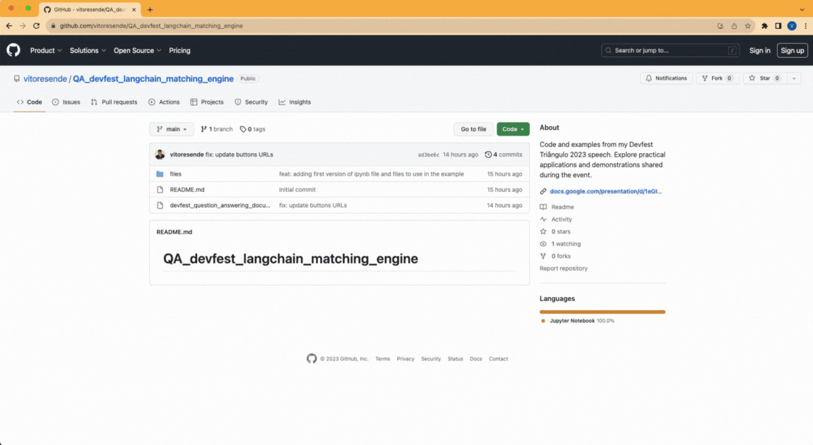
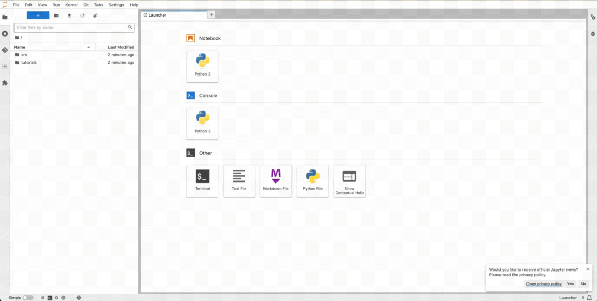

# Devfest Triângulo 2023 Presentation

This repository houses the code snippets and practical demonstrations discussed in my Devfest Triângulo 2023 speech. Explore the examples to gain deeper insights into **Vertex AI e soluções GCP: a chave para criar o seu próprio Bard**.

## Presentation Slides

Access the slides for my Devfest Triângulo 2023 presentation [here](https://docs.google.com/presentation/d/1eGIun7sAY5KjcE8NPTHhOKCivUVOxpZqzGatG0wKIW0/edit?usp=sharing).

**Note:** All the use cases and examples presented during the talk are based on the code available in the [GoogleCloudPlatform/generative-ai repository](https://github.com/GoogleCloudPlatform/generative-ai/blob/main/language/use-cases/document-qa/question_answering_documents_langchain_matching_engine.ipynb). Feel free to explore the repository for in-depth code details and additional resources.

## Getting Started

Firstly configure your GCP environment

### Configuring Google Cloud Platform (GCP)

1. **Create a GCP Project:**

   - [Create a new GCP project](https://console.cloud.google.com/projectcreate) if you don't have one.

2. **Enable Necessary APIs:**

   - In the [GCP Console](https://console.cloud.google.com/), navigate to the "APIs & Services" > "Library" section.
   - Enable the required APIs:
     - Vextex AI API
     - Notebooks API
     - Compute Engine API
     - Cloud Logging API

3. **Update Project ID:**
   - In the codebase, locate the **\[your-project-id\]** variables and replace it with your project value.

### Create you Vertex AI Workbench environment

To set up and run this project, follow these steps:

1. **Click on 'Open Vertex AI Workbench' button**

2. **Start the Jupyter Lab**
   - Copy the repository URL to copy the upload all files to the jupyter lab.
   - Click on the **ipynb** file and run the commands as you want to :)

